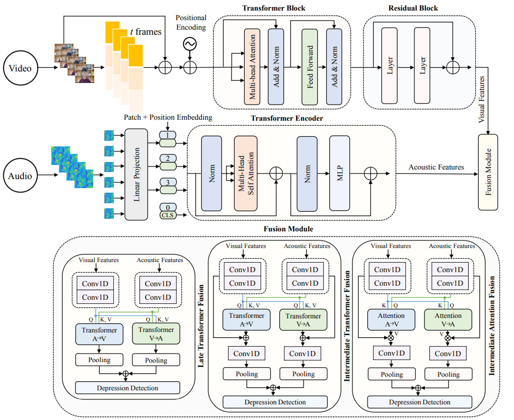

# Large-Scale-Multimodal-Depression-Detection

This repository is the official implementation of the following paper.

Paper Title: **[MMFformer: Multimodal Fusion Transformer Network for Depression Detection](https://arxiv.org/abs/2508.06701)**
<br/>
[Md Rezwanul Haque](https://scholar.google.com/citations?user=HaI-oFUAAAAJ&hl=en), [Md. Milon Islam](https://scholar.google.com/citations?user=ABC_LOAAAAAJ&hl=en), [S M Taslim Uddin Raju](https://scholar.google.com/citations?user=ToadRS8AAAAJ&hl=en), [Hamdi Altaheri](https://scholar.google.com/citations?user=UkfsK6EAAAAJ&hl=en), [Lobna Nassar](https://scholar.google.com/citations?user=3vcIuocAAAAJ&hl=en), [Fakhri Karray](https://uwaterloo.ca/scholar/karray)
<br/>

#### ***Proceedings of the 2025 IEEE International Conference on Systems, Man, and Cybernetics (SMC), Vienna, Austria. Copyright 2025 by the author(s).***

[](https://arxiv.org/abs/2508.06701)





## Abstract
> Depression is a serious mental health illness that significantly affects an individual’s well-being and quality of life, making early detection crucial for adequate care and treatment. Detecting depression is often difficult, as it is based primarily on subjective evaluations during clinical interviews. Hence, the early diagnosis of depression, thanks to the content of social networks, has become a prominent research area. The extensive and diverse nature of user-generated information poses a significant challenge, limiting the accurate extraction of relevant temporal information and the effective fusion of data across multiple modalities. This paper introduces MMFformer, a multimodal depression detection network designed to retrieve depressive spatio-temporal high-level patterns from multimodal social media information. The transformer network with residual connections captures spatial features from videos, and a transformer encoder is exploited to design important temporal dynamics in audio. Moreover, the fusion architecture fused the extracted features through late and intermediate fusion strategies to find out the most relevant intermodal correlations among them. Finally, the proposed network is assessed on two large-scale depression detection datasets, and the results clearly reveal that it surpasses existing state-of-the-art approaches, improving the F1-Score by 13.92% for D-Vlog dataset and 7.74% for LMVD dataset. The code is made available publicly at https://github.com/rezwanh001/Large-Scale-Multimodal-Depression-Detection.

----

**python implementation**

<!-- ```python
Version :   0.0.1  
Author  :   Md Rezwanul Haque
Email   :   rezwan@uwaterloo.ca 
``` -->
---
### **Related resources**:

**LOCAL ENVIRONMENT**  
```python
OS          :   Ubuntu 24.04.2 LTS       
Memory      :   128.0 GiB
Processor   :   Intel® Xeon® w5-3425 × 24
Graphics    :   2 x (NVIDIA RTX A6000)
GPU Memory  :   2 x (48 GB) = 96 GB
CPU(s)      :   24
Gnome       :   46.0 
```
---

### 1. Prepare Datasets

We use the [D-Vlog](https://doi.org/10.1609/aaai.v36i11.21483) and [LMVD](https://arxiv.org/abs/2407.00024) dataset, proposed in this paper. For the D-Vlog dataset, please fill in the form at the bottom of the [dataset website](https://sites.google.com/view/jeewoo-yoon/dataset), and send a request email to the [author](mailto:yoonjeewoo@gmail.com). For the LMVD dataset, please download features on the released [Baidu Netdisk website](https://pan.baidu.com/s/1gviwLfbFcRSaARP5oT9yZQ?pwd=tvwa) or [figshare](https://figshare.com/articles/dataset/LMVD/25698351). 

Following D-Vlog's setup, the dataset is split into train, validation and test sets with a 7:1:2 ratio. For the LMVD without official splitting, we randomly split the LMVD with a 7:1:2 ratio ~~a 8:1:1 ratio~~ and the specific division is stored in `../data/lmvd-dataset/lmvd_labels.csv'. 

Furthermore, you can run ``lmvd_extract_npy.py`` to obtain .npy features to train the model. You also can make labels with this code ``lmvd_prepare_labels.py``.

- **Note:** The pretrained model can be found [here](https://drive.google.com/file/d/1tA3HzeZh5Cvw78VjDAOBNQF6ZwmBuKPT/view?usp=sharing). [`ckpt_path='../pretrained_models/visualmae_pretrained.pth'`]

The pretrained model can be found here
:
ckpt_path='../pretrained_models/visualmae_pretrained.pth'

---

Thanks for the clarification. Based on your existing `parse_args()` and the provided training command, here are some **commonly used command-line examples** that work well for **both training and testing scenarios** using `mainkfold.py`. Each example assumes your script handles them appropriately.

---

### ✅ Common Command-Line Examples

---

#### 🔁 **1. Standard 10-Fold Training**

```bash
python mainkfold.py --train True --num_folds 10 --start_fold 0 \
--epochs 225 --batch_size 16 --learning_rate 1e-5 \
--model MultiModalDepDet --fusion it --dataset dvlog-dataset
```

```bash
python mainkfold.py --train True --num_folds 10 --start_fold 0 \
--epochs 225 --batch_size 16 --learning_rate 1e-5 \
--model MultiModalDepDet --fusion it --dataset lmvd-dataset
```

---

#### 🎯 **2. Resume Training from a Specific Fold**

```bash
python mainkfold.py --train True --num_folds 10 --start_fold 5 \
--epochs 225 --batch_size 16 --learning_rate 1e-5 \
--model MultiModalDepDet --fusion video --dataset dvlog-dataset \
--resume_path ../weights/dvlog-dataset_MultiModalDepDet_4/checkpoints/best_model.pt
```

---

#### 🧪 **3. Cross-corpus Validation**

```bash
python mainkfold.py --train True --cross_infer True \
--num_folds 10 --model MultiModalDepDet \
--fusion ia --dataset dvlog-dataset
```

```bash
python mainkfold.py --train True --cross_infer True \
--num_folds 10 --model MultiModalDepDet \
--fusion ia --dataset lmvd-dataset
```

---

#### 🧪 **4. Cross Inference with Fusion Strategy Testing**

```bash
python mainkfold.py --train False --cross_infer True \
--num_folds 5 --model MultiModalDepDet --fusion it \
--dataset dvlog-dataset
```

```bash
python mainkfold.py --train False --cross_infer True \
--num_folds 5 --model MultiModalDepDet --fusion it \
--dataset lmvd-dataset
```

---

#### 💻 **5. Train with GPU(s) and Multiple Heads**

```bash
python mainkfold.py --train True --num_folds 5 \
--device cuda:0 cuda:1 --num_heads 4 --fusion lt \
--model MultiModalDepDet --dataset dvlog-dataset \
--batch_size 16 --epochs 225 --learning_rate 1e-5
```

```bash
python mainkfold.py --train True --num_folds 5 \
--device cuda:0 cuda:1 --num_heads 4 --fusion lt \
--model MultiModalDepDet --dataset lmvd-dataset \
--batch_size 16 --epochs 225 --learning_rate 1e-5
```

---

#### 🔁 **6. WandB Enabled Training with TQDM Off**

```bash
python mainkfold.py --train True --if_wandb True --tqdm_able False \
--model MultiModalDepDet --fusion lt --dataset dvlog-dataset \
--batch_size 16 --epochs 225 --learning_rate 1e-5
```

```bash
python mainkfold.py --train True --if_wandb True --tqdm_able False \
--model MultiModalDepDet --fusion lt --dataset lmvd-dataset \
--batch_size 16 --epochs 225 --learning_rate 1e-5
```

---

#### ✅ All-in-One Command

```bash
python mainkfold.py \
  --train True \
  --num_folds 10 \
  --start_fold 0 \
  --epochs 225 \
  --batch_size 16 \
  --learning_rate 1e-5 \
  --model MultiModalDepDet \
  --fusion lt \
  --dataset lmvd-dataset \
  --device cuda \
  --cross_infer False \
  --resume_path "" \
  --begin_epoch 1 \
  --if_wandb False \
  --tqdm_able True \
  --num_heads 1
```
---

### 📖 Citation

- If you find this project useful for your research, please cite [our paper](https://arxiv.org/abs/****.*****):

```bibtex
@article{haque2025mmfformer,
  title = {MMFformer: Multimodal Fusion Transformer Network for Depression Detection},
  author = {Haque, Md Rezwanul and Islam, Md Milon and Raju, SM and Altaheri, Hamdi and Nassar, Lobna and Karray, Fakhri},
  journal = {arXiv preprint arXiv:2508.06701},
  year = {2025},
}
```

## License

This project is licensed under the [MIT License](LICENSE).

[](LICENSE)